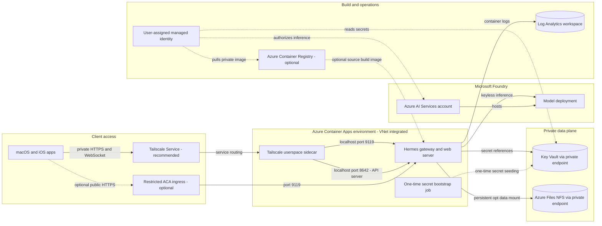

# Terraform IaC for running Hermes Agent on Azure

Terraform that runs the Hermes Agent container on **Azure Container Apps**, using
**Microsoft Foundry** models for inference via **keyless Entra ID** (managed
identity — no API keys stored). An optional **Tailscale Service** provides a
stable, private HTTPS endpoint for macOS and iOS without exposing Hermes to the
public internet.

This repository intentionally contains only Azure infrastructure and deployment
configuration. Hermes application source remains in
[`NousResearch/hermes-agent`](https://github.com/NousResearch/hermes-agent), so
upstream application updates can be consumed without merging infrastructure
changes into an application fork.

## What it provisions

| Resource | Purpose |
|----------|---------|
| Resource group | Container for everything below |
| User-assigned managed identity | Keyless auth to Foundry + ACR pull |
| Dedicated Key Vault | Runtime secrets referenced by the Container App through managed identity |
| Azure AI Services (Foundry) + model deployment | The LLM backend (e.g. `gpt-5.5`) |
| Role assignment | `Cognitive Services OpenAI User` on Foundry, scoped to the identity |
| Log Analytics workspace | Container logs |
| VNet + subnets | VNet-injected environment (required for keyless NFS) + a private-endpoint subnet |
| Premium FileStorage account + NFS share | Durable, keyless `/opt/data` (config, sessions, memory, SQLite) |
| Private endpoints + private DNS zones | Reach the NFS share and Key Vault privately from the VNet |
| Container Apps environment + Hermes app | Runs `gateway run` with the web/app server on port 9119 |
| (optional) Tailscale sidecar | Advertises a stable `svc:hermes` HTTPS endpoint over the tailnet using userspace networking |
| (optional) Hermes API server | OpenAI-compatible `/v1/...` server on loopback `127.0.0.1:8642`, published only over Tailscale on port `8443` |
| (optional) Container Registry | Only when building the cloned repo from source |

The gateway runs the messaging gateway **and** the web server that the native
apps connect to (WebSocket at `/hermes/api/ws`), behind HTTPS basic auth.

The web dashboard and the API server are two different surfaces. Browsers and
the dashboard WebSocket use port `443`; OpenAI-compatible API clients (the iOS
app, OpenAI SDKs, `curl /v1/models`) must use port `8443` with an
`Authorization: Bearer` key. Pointing an API client at `443` returns the
dashboard login redirect, not JSON.

## Architecture

<!-- mermaid-checked: no \n, no em-dash/en-dash, no {} in labels, subgraphs are id["label"], arrows are -->|"label"|, all subgraphs closed by end, ids unique -->


Key Vault and Azure Files expose no public data-plane path. The Container App
reaches both through VNet private endpoints, while its user-assigned managed
identity provides keyless authorization to Foundry, Key Vault, and optional ACR.

## Prerequisites

- [Terraform](https://developer.hashicorp.com/terraform/downloads) >= 1.6
- [TFLint](https://github.com/terraform-linters/tflint) >= 0.46
- [Azure CLI](https://learn.microsoft.com/cli/azure/install-azure-cli), logged in: `az login`
- Rights to create resources and assign roles in the subscription
- Foundry model quota in the target region (check with `az cognitiveservices usage list -l <region>`)
- For private access: a [Tailscale](https://tailscale.com/) tailnet, admin rights
  to configure its policy and credentials, and Tailscale installed and signed
  in on each macOS or iOS client

## Terraform state

The root module uses an explicit local backend at `terraform.tfstate`. State and
backup files are ignored by Git. Treat them as sensitive because Terraform
state can contain resource identifiers, generated values, and configuration
data even when application secrets are stored separately in Key Vault.

This mode is intended for one operator on one trusted workstation:

- Keep `terraform.tfstate` on encrypted local storage with restrictive file
  permissions.
- Back up the state before each plan or apply and after each successful apply.
- Do not run Terraform for this deployment concurrently or from another
  workstation. The local backend has no shared locking.
- Do not delete the local state after uploading a copy. The uploaded blob is a
  disaster-recovery snapshot, not an active Terraform backend.

Set provider authentication in the environment, then initialize normally:

```bash
export ARM_SUBSCRIPTION_ID="00000000-0000-0000-0000-000000000000"
export ARM_TENANT_ID="00000000-0000-0000-0000-000000000000"
export ARM_USE_AZUREAD=true
export ARM_USE_CLI=true

terraform init
```

If this checkout was previously initialized with the AzureRM backend, switch
the cached backend metadata to local without attempting a state migration:

```bash
terraform init -reconfigure
terraform state list
```

### Back up local state to Azure Blob Storage

After a successful apply, create a timestamped snapshot and checksum:

```bash
STATE_SNAPSHOT="terraform.tfstate.$(date -u +%Y%m%dT%H%M%SZ).backup"
terraform state pull >"$STATE_SNAPSHOT"
chmod 600 "$STATE_SNAPSHOT"
shasum -a 256 "$STATE_SNAPSHOT" >"$STATE_SNAPSHOT.sha256"
```

Upload both files manually to the private `tfstate` container in storage account
`satfstate58fbd60142ea`, using a unique blob path such as
`manual-backups/hermes-agent/<timestamp>/`. Authenticate with Microsoft Entra
ID; do not enable shared-key access or create a public container. Keep blob
versioning and soft delete enabled.

Before considering a snapshot valid, confirm both blobs are present and retain
the local copy. A manual upload provides backup and recovery only: Terraform
does not lock, read, or update that blob. For recovery, stop all Terraform
activity, preserve the current local state, download a selected snapshot,
verify its SHA-256 checksum, and run `terraform show` against it before any
replacement of `terraform.tfstate`.

## Deploy

### 1. Configure Terraform

```bash
git clone https://github.com/mikefelder/hermes-agent-azure.git
cd hermes-agent-azure
cp terraform.tfvars.example terraform.tfvars
# Export ARM_SUBSCRIPTION_ID as described above and review region/model settings.
# Run terraform init; existing AzureRM-backend checkouts use init -reconfigure once.
```

### 2. Bootstrap the dedicated Key Vault

Secret values are never accepted as Terraform variables or managed as
`azurerm_key_vault_secret` resources, so they do not enter new Terraform state.
Create the vault, private endpoint/DNS path, and current operator's
`Key Vault Secrets Officer` role first through a reviewed targeted plan:

```bash
terraform plan \
  -target=azurerm_role_assignment.key_vault_secrets_officer \
  -target=azurerm_private_endpoint.key_vault \
  -target=azurerm_private_dns_zone_virtual_network_link.vault \
  -out=key-vault-bootstrap.tfplan
terraform apply key-vault-bootstrap.tfplan

KEY_VAULT_NAME="$(terraform output -raw key_vault_name)"
```

Role assignments can take several minutes to propagate. The vault has public
network access disabled, so the Azure portal and local data-plane commands will
fail unless the operator has private VNet connectivity. When no VPN or jump host
exists, use the disabled-by-default one-time Container Apps Job below. It runs
inside the existing VNet, uses a dedicated temporary managed identity, and never
places secret values in Terraform configuration or state.

Populate these required secrets using the approved path:

| Secret name | Purpose |
|---|---|
| `hermes-dashboard-password` | Dashboard basic-auth password |
| `hermes-dashboard-signing-secret` | Dashboard session-signing secret |
| `hermes-api-server-key` | Bearer key for the OpenAI-compatible API server. Only when `enable_api_server = true` (see section 3.5) |

Review and apply only the three temporary resources:

```bash
terraform plan \
  -var='enable_secret_bootstrap=true' \
  -target='azurerm_user_assigned_identity.secret_bootstrap[0]' \
  -target='azurerm_role_assignment.secret_bootstrap[0]' \
  -target='azurerm_container_app_job.secret_bootstrap[0]' \
  -out=secret-bootstrap.tfplan
terraform apply secret-bootstrap.tfplan
```

Start the job. The helper accepts the dashboard password through a hidden local
prompt, temporarily sends it to the job through Azure Resource Manager, and
generates the signing secret inside Azure. It never prints either value:

```bash
python3 scripts/seed-key-vault-via-job.py seed
python3 scripts/seed-key-vault-via-job.py status
```

Do not continue until `status` reports `Succeeded`. Then remove the temporary
job secret before reviewing and applying the three-resource cleanup plan:

```bash
python3 scripts/seed-key-vault-via-job.py scrub
terraform plan -destroy \
  -var='enable_secret_bootstrap=true' \
  -target='azurerm_container_app_job.secret_bootstrap[0]' \
  -target='azurerm_role_assignment.secret_bootstrap[0]' \
  -target='azurerm_user_assigned_identity.secret_bootstrap[0]' \
  -out=secret-bootstrap-destroy.tfplan
terraform apply secret-bootstrap-destroy.tfplan
```

Confirm Azure and `terraform state list` contain no `secret_bootstrap`
resources. A successful execution exits only after both required Key Vault PUT
operations complete. Operators with an approved private route may instead use
their normal secret-management workflow from that network.

The vault uses RBAC, purge protection, and a 90-day soft-delete retention
period. Public network access is disabled. The private endpoint and
`privatelink.vaultcore.azure.net` zone let the VNet-integrated Container Apps
environment resolve Key Vault references without exposing the data plane.

### 3. Configure Tailscale private access

Tailscale is optional, but it is the recommended client-access path. The
Container App runs the official Tailscale image in userspace mode, so it does
not require `/dev/net/tun`, privileged mode, or additional Linux capabilities.
Each Container Apps revision registers an ephemeral, tagged node and advertises
the stable `svc:hermes` Service. The Service address therefore remains stable
when Azure replaces a revision.

Azure Container Apps exposes Kubernetes-related environment metadata even
though the sidecar must use ephemeral local state. Terraform therefore sets
`TS_KUBE_SECRET` to an empty value explicitly. The sidecar starts
`containerboot`, waits until `tailscale status --json` reports a `Running`
backend, and only then runs `tailscale serve --service=svc:hermes`. Preserve
this ordering: applying the Serve configuration before login completes can
leave the node connected without an active Service endpoint. When
`enable_api_server = true`, the sidecar applies a second Serve mapping that
fronts the loopback API server on HTTPS port `8443`.

#### 3.1 Add the tag and access policy

Open [Access controls](https://login.tailscale.com/admin/acls) in the Tailscale
admin console and merge the following entries into the existing tailnet policy.
Do not replace existing groups, grants, tag owners, or auto-approvers. Replace
`you@example.com` with the Tailscale login that may administer the Hermes tag:

```json
{
  "tagOwners": {
    "tag:hermes": ["you@example.com"]
  },
  "autoApprovers": {
    "services": {
      "svc:hermes": ["tag:hermes"]
    }
  },
  "grants": [
    {
      "src": ["you@example.com"],
      "dst": ["svc:hermes"],
      "ip": ["tcp:443", "tcp:8443"]
    }
  ]
}
```

For multiple users, define a group such as `group:hermes-users` in the policy
and use that group as the grant's `src`. Port `443` serves the web dashboard and
port `8443` serves the OpenAI-compatible API server; omit `tcp:8443` when
`enable_api_server` stays `false`, and add no other destination ports unless
another protocol is deliberately added. Save the policy and resolve any
validation errors before continuing.

#### 3.2 Create the Tailscale Service

1. Open [Services](https://login.tailscale.com/admin/services).
2. Select **Advertise**, then **Define a Service**.
3. Set the Service name to `hermes`. This creates `svc:hermes`.
4. Add endpoint `tcp:443`, and `tcp:8443` when the API server is enabled.
5. Optionally assign a descriptive service tag, then select **Add service**.

The service receives a stable MagicDNS name of the form
`hermes.<tailnet-name>.ts.net` and stable TailVIPs. Record the exact DNS suffix
shown by Tailscale; it becomes `tailscale_tailnet_dns_name` below.

#### 3.3 Create the OAuth credential

1. Open [Trust credentials](https://login.tailscale.com/admin/settings/trust-credentials).
2. Select **Credential**, then **OAuth**.
3. Grant the `auth_keys` scope and authorize only `tag:hermes` for that scope.
4. Generate the credential.
5. Record the client secret immediately. Tailscale displays it only once. The
   Container App does not require the client ID for this authentication mode.

The OAuth secret is intentionally used instead of a reusable auth key. The
Tailscale container exchanges it for ephemeral, tagged node credentials at
startup. Do not put the OAuth secret in `terraform.tfvars`, shell arguments,
source control, or Terraform-managed resources.

Because the dedicated Key Vault has no public data-plane access, seed the OAuth
secret by repeating the temporary Container Apps Job lifecycle from section 2.
Review and apply only the three temporary resources:

```bash
terraform plan \
  -var='enable_secret_bootstrap=true' \
  -target='azurerm_user_assigned_identity.secret_bootstrap[0]' \
  -target='azurerm_role_assignment.secret_bootstrap[0]' \
  -target='azurerm_container_app_job.secret_bootstrap[0]' \
  -out=tailscale-secret-bootstrap.tfplan
terraform apply tailscale-secret-bootstrap.tfplan

python3 scripts/seed-key-vault-via-job.py seed-tailscale
python3 scripts/seed-key-vault-via-job.py status
```

The helper prompts twice without echo and never prints the value. Do not
continue until `status` reports `Succeeded`. Then scrub the temporary job secret
and destroy all three temporary resources:

```bash
python3 scripts/seed-key-vault-via-job.py scrub
terraform plan -destroy \
  -var='enable_secret_bootstrap=true' \
  -target='azurerm_container_app_job.secret_bootstrap[0]' \
  -target='azurerm_role_assignment.secret_bootstrap[0]' \
  -target='azurerm_user_assigned_identity.secret_bootstrap[0]' \
  -out=tailscale-secret-bootstrap-destroy.tfplan
terraform apply tailscale-secret-bootstrap-destroy.tfplan
```

Confirm Azure and `terraform state list` contain no `secret_bootstrap`
resources before enabling the Tailscale sidecar. The OAuth client ID is not
required by the container and must not be substituted for the client secret.

Revoking the OAuth credential prevents future revisions from joining but does
not remove an already connected node immediately. Revoke the credential and
remove active Hermes nodes from the Tailscale **Machines** page when responding
to a credential compromise.

#### 3.4 Enable the staged rollout

Set the following in `terraform.tfvars`. Keep the existing restricted ACA
ingress enabled for this first rollout so it remains a recovery path:

```hcl
enable_tailscale           = true
enable_public_ingress      = true
tailscale_service_name     = "hermes"
tailscale_tailnet_dns_name = "example-tailnet.ts.net" # use the suffix shown by Tailscale
tailscale_tag              = "tag:hermes"

# This is a Key Vault secret name, not the secret value.
tailscale_oauth_client_secret_name = "tailscale-oauth-client-secret"

allowed_ingress_ips        = ["203.0.113.10/32"] # temporary recovery path
allow_unrestricted_ingress = false
```

The Tailscale image is pinned by digest in Terraform. Update that digest only
after reviewing and verifying a specific upstream Tailscale release.

#### 3.5 Enable the OpenAI-compatible API server

The web dashboard on port `443` is a browser surface. API clients need Hermes'
OpenAI-compatible API server, which Terraform binds to `127.0.0.1:8642` and
publishes only through the Tailscale sidecar on HTTPS port `8443`. It is never
reachable through the public Azure ingress.

Seed the bearer key first. Generate a long random value locally, keep it in a
password manager, and paste it at the hidden prompt. Repeat the temporary
bootstrap-job lifecycle from section 2, using the `seed-api` action:

```bash
python3 -c 'import secrets; print("sk-hermes-" + secrets.token_urlsafe(32))'

python3 scripts/seed-key-vault-via-job.py seed-api
python3 scripts/seed-key-vault-via-job.py status
python3 scripts/seed-key-vault-via-job.py scrub
```

Then enable the server. `enable_api_server` requires `enable_tailscale`, since
the API server has no other reachable path:

```hcl
enable_api_server = true

# Key Vault secret name only. Never put the key value in this file.
api_server_key_secret_name = "hermes-api-server-key"
```

Re-applying with a different value in that Key Vault secret rotates the key on
the next revision, and every API client must be updated at the same time.
Confirm the Tailscale grant and Service endpoint include `tcp:8443` from
sections 3.1 and 3.2, or the port fails closed at the tailnet.

Order matters: seed the Key Vault secret and update the tailnet policy first,
then run the full apply in section 4, then verify with section 5 step 4. A
revision that references a Key Vault secret which does not yet exist fails to
provision.

To confirm which secrets exist without a private data-plane route, list them
through the ARM management plane. It returns names and attributes only, never
values, and is unaffected by the vault firewall. The response is paginated, so
follow `nextLink`:

```bash
KV="$(terraform output -raw key_vault_name)"
SUB="$(az account show --query id -o tsv)"
URL="https://management.azure.com/subscriptions/$SUB/resourceGroups/$(terraform output -raw resource_group_name)/providers/Microsoft.KeyVault/vaults/$KV/secrets?api-version=2024-11-01"
while [ -n "$URL" ] && [ "$URL" != "None" ]; do
  az rest --method get --url "$URL" --query "value[].[name, properties.attributes.enabled]" -o tsv
  URL="$(az rest --method get --url "$URL" --query nextLink -o tsv)"
done
```

Skip the seeding above if `hermes-api-server-key` is already present. Secret
values are deliberately unreadable from an unprivileged network location; verify
the value functionally with section 5 step 4 instead.

### 4. Plan and deploy the complete stack

Do not continue until every configured Key Vault secret exists. During the
Tailscale migration, retain one or more restricted IPv4 CIDRs:

```hcl
allowed_ingress_ips = ["203.0.113.10/32"] # replace with an approved public IP
```

An intentionally public deployment must opt in with
`allow_unrestricted_ingress = true` and leave `allowed_ingress_ips = []`.

Run local checks before creating a plan:

```bash
terraform fmt -check
terraform validate
tflint --init
tflint
```

Always save and review a plan before applying it. Investigate every replacement
or deletion; do not use `-auto-approve` for this stack:

```bash
terraform plan -out=hermes.tfplan
terraform show hermes.tfplan
terraform apply hermes.tfplan
```

After apply:

```bash
terraform output next_steps
```

Then in the macOS / iOS Hermes app, connect to a remote gateway with the
`app_url`, the `dashboard_username`, and the dashboard password from the
approved secret-management workflow.

### 5. Verify Tailscale and remove public ingress

1. Install Tailscale on each macOS or iOS client and sign in to the tailnet.
2. In the Tailscale **Services** page, open `hermes` and verify its state is
   **Connected** with an active service host. The `autoApprovers` policy should
   approve it automatically. If it remains **Pending approval**, select the
   pending host and approve it manually after confirming it has `tag:hermes`.
3. Read the preferred URL and test both HTTPS and the Hermes client:

```bash
terraform output -raw tailscale_service_url
curl --silent --show-error --output /dev/null --write-out '%{http_code}\n' \
  "$(terraform output -raw tailscale_service_url)"
```

An HTTP `302` redirect to `/login` or an HTTP `401` from the unauthenticated
request is acceptable because either confirms that Tailscale routing, TLS, and
Hermes authentication are active. A DNS, timeout, or TLS error is not. Then
connect the Hermes macOS or iOS app to the same URL with the configured
dashboard credentials and confirm its WebSocket connection works.

4. Verify the API surface separately. This step applies only after section 3.5
   has been completed **and** a full `terraform apply` has run: `api_server_url`
   is an output, so it does not exist in state until then, and querying it
   earlier fails with `Output "api_server_url" not found`. The request must
   return JSON, not a login redirect:

```bash
curl --silent --show-error --fail \
  -H "Authorization: Bearer $HERMES_API_KEY" \
  "$(terraform output -raw api_server_url)/v1/models"
```

Point the iOS app at `api_server_url` (the `:8443` URL), leave the username
blank so it sends the key as a Bearer token, and enter the API key as the
secret. The dashboard URL on port `443` is not a valid API base URL.

Only after browser and native-client verification, disable the Azure endpoint:

```hcl
enable_tailscale           = true
enable_public_ingress      = false
allowed_ingress_ips        = []
allow_unrestricted_ingress = false
```

Run the formatting, validation, saved-plan review, and apply workflow again.
The plan should remove only the Container App ingress configuration and create
a new revision with Hermes bound to `127.0.0.1:9119`; it must not replace the
Container App or durable storage. Confirm the ACA FQDN is null and the
Tailscale URL still works:

```bash
terraform output app_fqdn
terraform output -raw app_url
```

## Image options

- **Default (`build_image_from_source = false`)** — pulls the public
  `nousresearch/hermes-agent` image pinned to a verified SHA-256 manifest
  digest. Fast; no ACR. Update `public_image` deliberately to adopt a new
  release.
- **Build from upstream (`build_image_from_source = true`)** — runs
  `az acr build` against `hermes_source_repository#hermes_source_ref` and pushes
  the result to a private ACR. `hermes_source_ref` must be a v-prefixed release
  tag or full commit SHA, and `image_tag` cannot be `latest`. Set
  `source_context_path` to a local Hermes checkout only when testing application
  changes. The first build takes ~20-40 min (SQLite, Node, Playwright). Changing
  either immutable version input creates a new Container Apps revision.

To update Hermes, verify the upstream release and image digest, change the
immutable input in `terraform.tfvars`, and run the validation and saved-plan
workflow above. Do not replace a pinned version with `main` or `latest`.

## Add a messaging platform

Map the environment variable to a Key Vault secret name in `terraform.tfvars`:

```hcl
gateway_secret_names = {
  TELEGRAM_BOT_TOKEN = "telegram-bot-token"
}
```

Populate `telegram-bot-token` in Key Vault through the approved secret workflow,
then run and review a new Terraform plan. Terraform stores only the versionless
Key Vault URI; Container Apps retrieves the current secret version through its
managed identity. See the Hermes documentation for each platform's required
environment variables.

## Secret migration

Existing local state and backups created before the Key Vault migration contain
the old dashboard credentials. After the Key Vault references are deployed and
verified:

1. Rotate the dashboard password and signing secret in Key Vault.
2. Confirm the Container App resolves the new versions and authentication works.
3. Preserve the current authoritative local state and create a new timestamped,
  checksummed Blob snapshot as described above.
4. After a no-surprise plan confirms the migration is complete, dispose of only
  the pre-migration backups that contain retired credentials according to your
  secret-handling policy. Do not delete the current local state.

## Verify and operate

After apply, confirm the active revision is healthy before discarding the saved
plan or state backup:

```bash
terraform output app_url
az containerapp revision list \
  --name "$(terraform output -raw container_app_name)" \
  --resource-group "$(terraform output -raw resource_group_name)" \
  --output table
az containerapp logs show \
  --name "$(terraform output -raw container_app_name)" \
  --resource-group "$(terraform output -raw resource_group_name)" \
  --follow
```

If names differ from the defaults, obtain them from the reviewed plan or Azure
resource group rather than guessing. Log output can contain application data;
handle and retain it according to the same policy as other operational data.

## Rollback

Rollback is a new reviewed Terraform change, not a manual state edit. Revert
the offending configuration or restore the previously pinned image/source
version in version control, then run `terraform fmt -check`, `terraform
validate`, and a fresh saved plan. Apply only after the plan shows the expected
in-place update and no unintended replacement or deletion.

Do not copy an old snapshot over current local state, use `terraform state rm`,
or select an older Container Apps revision behind Terraform's back. For state
recovery, stop all Terraform activity and follow the checksum and inspection
procedure in this README before replacing any file.

## Notes & limits

- **Single replica** (`min = max = 1`): the gateway owns a shared SQLite state
  directory, so exactly one instance runs. No scale-to-zero (keeps messaging
  and app connections alive).
- **Durable keyless state**: because the subscription's Azure Policy disables
  storage-account keys, persistence uses a Premium FileStorage **NFS** share
  (keyless) mounted at `/opt/data`. NFS from Container Apps requires a
  **VNet-injected environment** and a **private endpoint** (service-endpoint
  firewall rules are not honored for the NFS data path), plus a private DNS
  zone so `<account>.file.core.windows.net` resolves to the private IP. The
  init container seeds `config.yaml` only if missing, so restarts preserve
  sessions, memory, and the SQLite DB.
- **Foundry authentication**: local key authentication is disabled explicitly.
  The Container App uses its user-assigned managed identity and the declared
  Foundry RBAC roles; API keys are not a supported fallback.
- **Tailscale identity**: the sidecar uses an OAuth credential to create an
  ephemeral `tag:hermes` node per revision. No Tailscale state is shared across
  revisions. `svc:hermes` supplies the stable client endpoint and automatically
  provisions tailnet HTTPS for the local `127.0.0.1:9119` proxy.
- **Ingress policy**: while `enable_public_ingress = true`, at least one valid
  IPv4 CIDR is required unless unrestricted access is explicitly enabled. Set
  `enable_public_ingress = false` only with Tailscale enabled; Terraform then
  requires the CIDR list to be empty and binds Hermes to loopback.
- **External dependency**: Tailscale access depends on the Tailscale control
  plane and clients being connected to the tailnet. Keep Hermes basic auth as
  defense in depth, and test iOS VPN coexistence with any other required VPN.
- **Foundry roles**: the default grants `Cognitive Services OpenAI User` (the
  correct role for gpt-5.x inference). Add `Azure AI User` to
  `foundry_role_definition_names` only if that role exists in your tenant.
- **GPT-5 / o-series models**: Hermes auto-routes these to the Responses API by
  name, so the default `gpt-5.5` works without changing `api_mode`. Newer
  `gpt-5.6-*` variants are also available set `model_name` / `model_version`
  to switch.

